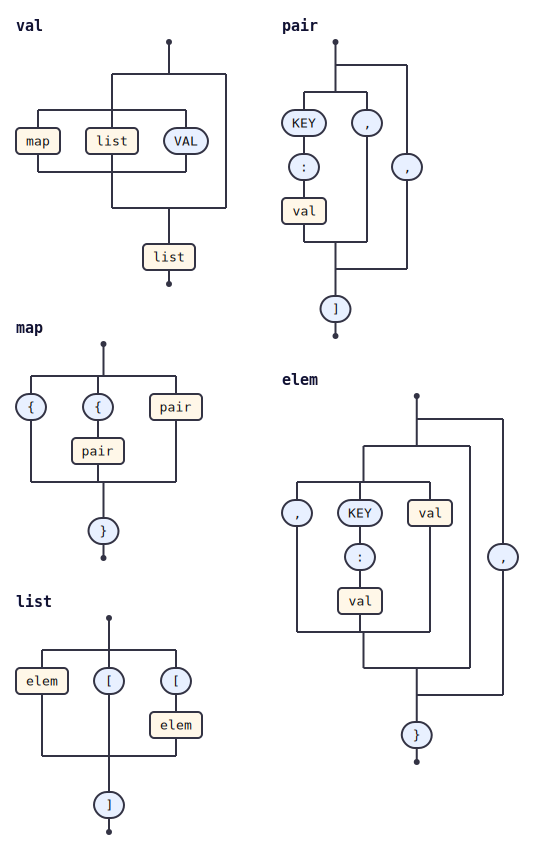

# jsonic

<!-- tabnas-badges -->
[](https://www.npmjs.com/package/@tabnas/jsonic)
[](https://github.com/tabnas/jsonic/actions/workflows/ci.yml)
[](https://pkg.go.dev/github.com/tabnas/jsonic/go)
[](https://tabnas.github.io/status/)
<!-- /tabnas-badges -->

A dynamic JSON parser that isn't strict and can be customized.

```
a:1,foo:bar  →  {"a": 1, "foo": "bar"}
```

jsonic accepts all standard JSON and then relaxes it for humans:
unquoted keys, implicit objects and arrays, comments, trailing commas,
single/backtick quotes, and path diving.

## Choose your runtime

| Runtime | Start here |
|---|---|
| **TypeScript / JavaScript** (canonical, `jsonic` on npm) | [`ts/README.md`](ts/README.md) |
| **Go** (`github.com/tabnas/jsonic/go`) | [`go/README.md`](go/README.md) |

Both packages are grammar plugins built on the
[`tabnas`](https://github.com/tabnas/parser) parsing engine, layering
jsonic's relaxed syntax on the standard-JSON core supplied by the
[`@tabnas/json`](https://github.com/tabnas/json) plugin (TypeScript uses
the npm packages, Go uses `github.com/tabnas/parser/go` and
`github.com/tabnas/json/go`). TypeScript is canonical — both runtimes
share the conformance fixtures in [`ts/test/spec/`](ts/test/spec/) and
produce the same parse results.

## Documentation

Organized by what you are trying to do:

- **Learning** — tutorials: [TypeScript](ts/doc/tutorial.md), [Go](go/doc/tutorial.md).
- **Tasks** — how-to guides ([TS](ts/doc/guide.md), [Go](go/doc/guide.md))
  and plugin guides ([TS](ts/doc/plugins.md), [Go](go/doc/plugins.md)).
- **Reference** — syntax, API, and options per runtime
  ([TS](ts/doc/syntax.md) / [Go](go/doc/syntax.md), and the api/options
  docs alongside them).
- **Understanding** — concepts ([TS](ts/doc/concepts.md), [Go](go/doc/concepts.md))
  and the Go [differences from TypeScript](go/doc/differences.md).

Working on the codebase? Each directory has an `AGENTS.md` with build,
layout, and contribution notes; start with [`AGENTS.md`](AGENTS.md).

## Grammar diagram

The grammar as a railroad/syntax diagram, generated from the live grammar
with [`@tabnas/railroad`](https://github.com/tabnas/railroad):



ASCII version: [`ts/doc/grammar.txt`](ts/doc/grammar.txt).

## License

MIT. Copyright (c) Richard Rodger.
